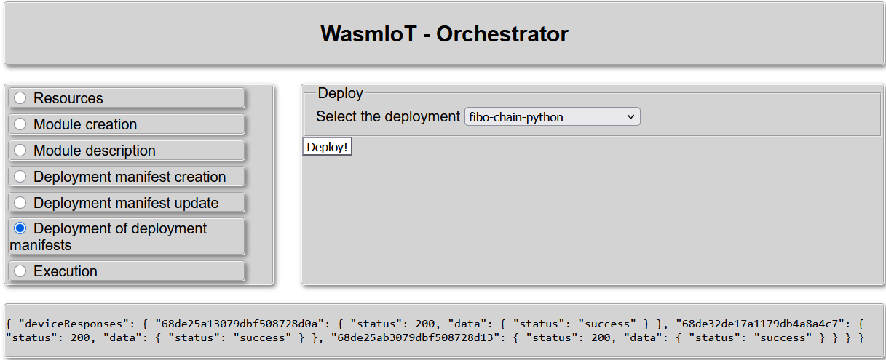

# Example of a deployment containing three chained stages

<!-- no toc -->
- [Python supervisors](#fibonacci-chain-with-python-supervisors)
- [Rust supervisors](#fibonacci-chain-with-rust-supervisors)
- [General data flow](#general-data-flow)

This folder contains an example of creating a deployment containing three chained stages, and how to get the final result from the deployment.

This example uses the `Test 1` setup from [deployment-tests](../deployment-tests) which deploys an orchestrator and six supervisors (3 Python and 3 Rust versions).

The chained deployment is a simple Fibonacci chain where the `fibo` function is called repeatedly in three separate supervisors.

## Fibonacci chain with Python supervisors

- Creating deployment manifest: 
- Deploying the deployment manifest: 
- Executing the deployment with the orchestrator: 
    - From the orchestrator's output it can be determined that with input `5` the final result is `9227465` which is the expected result based on the `fibo` function implementation (from [https://github.com/LiquidAI-project/wasmiot-modules/blob/main/modules/fibo/src/lib.rs](https://github.com/LiquidAI-project/wasmiot-modules/blob/main/modules/fibo/src/lib.rs))
- Determining the start URL for manual query: 
- Using manual queries with `curl` to determine the final result:

    - user request:

    ```bash
    curl "http://172.29.207.214:5002/68de33d217a1179db4a8a4d9/modules/fibo/fibo?param0=5"
    ```

    - supervisor response:

    ```json
    {
        "resultUrl": "http://172.29.207.214:5002/request-history/68de33d217a1179db4a8a4d9:fibo:fibo:3"
    }
    ```

    - user request:

    ```bash
    curl "http://172.29.207.214:5002/request-history/68de33d217a1179db4a8a4d9:fibo:fibo:3"
    ```

    - supervisor response:

    ```json
    {
        "deployment_id": "68de33d217a1179db4a8a4d9",
        "function_name": "fibo",
        "method": "GET",
        "module_name": "fibo",
        "request_args": {
            "param0": "5"
        },
        "request_files": {},
        "request_id": "68de33d217a1179db4a8a4d9:fibo:fibo:3",
        "result": "http://172.25.0.11:5001/request-history/68de33d217a1179db4a8a4d9:fibo:fibo:3",
        "success": true,
        "work_queued_at": "Thu, 02 Oct 2025 11:46:44 GMT"
    }
    ```

    - user request:

    ```bash
    curl "http://172.25.0.11:5001/request-history/68de33d217a1179db4a8a4d9:fibo:fibo:3"
    ```

    - supervisor response:

    ```json
    {
        "deployment_id": "68de33d217a1179db4a8a4d9",
        "function_name": "fibo",
        "method": "GET",
        "module_name": "fibo",
        "request_args": {
            "param0": "8"
        },
        "request_files": {},
        "request_id": "68de33d217a1179db4a8a4d9:fibo:fibo:3",
        "result": "http://172.25.0.12:5003/request-history/68de33d217a1179db4a8a4d9:fibo:fibo:3",
        "success": true,
        "work_queued_at": "Thu, 02 Oct 2025 08:46:44 GMT"
    }
    ```

    - user request:

    ```bash
    curl "http://172.25.0.12:5003/request-history/68de33d217a1179db4a8a4d9:fibo:fibo:3"
    ```

    - supervisor response:

    ```json
    {
        "deployment_id": "68de33d217a1179db4a8a4d9",
        "function_name": "fibo",
        "method": "GET",
        "module_name": "fibo",
        "request_args": {
            "param0": "34"
        },
        "request_files": {},
        "request_id": "68de33d217a1179db4a8a4d9:fibo:fibo:3",
        "result": [
            "9227465",
            null
        ],
        "success": true,
        "work_queued_at": "Thu, 02 Oct 2025 08:46:44 GMT"
    }
    ```

    - From this response, it can be determined that with input `5` the final result is `9227465`.

## Fibonacci chain with Rust supervisors

- Creating deployment manifest: 
- Deploying the deployment manifest: 
- Executing the deployment with the orchestrator: 
    - From the orchestrator's output it can be seen that the orchestrator does not know how to properly handle responses from chain deployments with Rust supervisors.
- Determining the start URL for manual query: 
- Using manual queries with `curl` to determine the final result:

    - user request:

    ```bash
    curl "http://172.24.0.1:6002/68de337217a1179db4a8a4d7/modules/fibo/fibo?param0=5"
    ```

    - supervisor response:

    ```json
    {
        "resultUrl": "http://172.29.207.214:6002/request-history/cfdb1770adc3a6feb070d7e03dbce712537a5f3b6b7996184611cab490920f02"
    }
    ```

    - user request:

    ```bash
    curl "http://172.29.207.214:6002/request-history/cfdb1770adc3a6feb070d7e03dbce712537a5f3b6b7996184611cab490920f02"
    ```

    - supervisor response:

    ```json
    {
        "request_id": "cfdb1770adc3a6feb070d7e03dbce712537a5f3b6b7996184611cab490920f02",
        "deployment_id": "68de337217a1179db4a8a4d7",
        "module_name": "fibo",
        "function_name": "fibo",
        "method": "GET",
        "request_args": {
            "param0": "5"
        },
        "request_files": {},
        "work_queued_at": "2025-10-02T08:39:49.285687741Z",
        "result": {
            "resultUrl": "http://172.25.0.21:6001/request-history/b71229f4c4ea60c23a3529abca6b8c631a394a605b8b697189358b3235c2da0e"
        },
        "success": true
    }
    ```

    - user request:

    ```bash
    curl "http://172.25.0.21:6001/request-history/b71229f4c4ea60c23a3529abca6b8c631a394a605b8b697189358b3235c2da0e"
    ```

    - supervisor response:

    ```json
    {
        "request_id": "b71229f4c4ea60c23a3529abca6b8c631a394a605b8b697189358b3235c2da0e",
        "deployment_id": "68de337217a1179db4a8a4d7",
        "module_name": "fibo",
        "function_name": "fibo",
        "method": "GET",
        "request_args": {
            "param0": "8"
        },
        "request_files": {},
        "work_queued_at": "2025-10-02T08:39:49.328492443Z",
        "result": {
            "resultUrl": "http://172.25.0.22:6003/request-history/3a55e2e2cbe0427688bd793e1ed7824dd9d98c92f85b5cd25445bdfb11050d5d"
        },
        "success": true
    }
    ```

    - user request:

    ```bash
    curl "http://172.25.0.22:6003/request-history/3a55e2e2cbe0427688bd793e1ed7824dd9d98c92f85b5cd25445bdfb11050d5d"
    ```

    - supervisor response:

    ```json
    {
        "request_id": "3a55e2e2cbe0427688bd793e1ed7824dd9d98c92f85b5cd25445bdfb11050d5d",
        "deployment_id": "68de337217a1179db4a8a4d7",
        "module_name": "fibo",
        "function_name": "fibo",
        "method": "GET",
        "request_args": {
            "param0": "34"
        },
        "request_files": {},
        "work_queued_at": "2025-10-02T08:39:49.333995224Z",
        "result": {
            "result": "9227465"
        },
        "success":true
    }
    ```

    - From this response, it can be determined that with input `5` the final result is `9227465`, the same result as with the Python supervisors.
        - input = `5` → `8` → `34` → `9227465` = output

## General data flow


`draw.io` file: [./drawio/orchestration_sequence_diagram.drawio](./drawio/orchestration_sequence_diagram.drawio)
